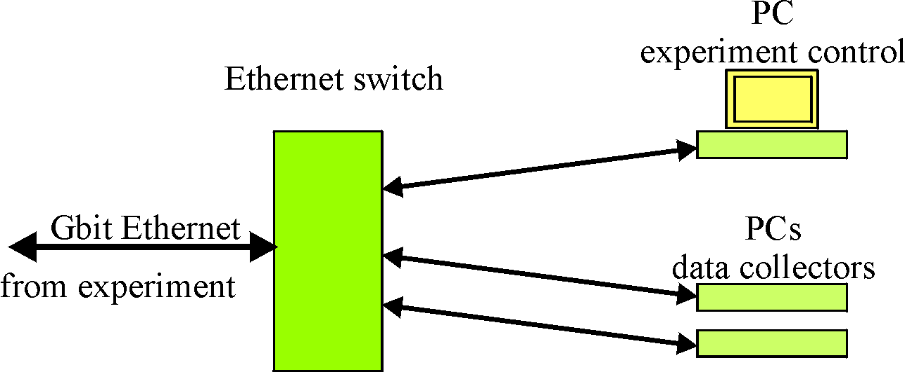
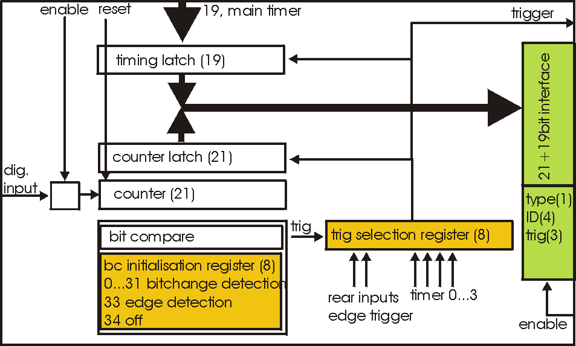
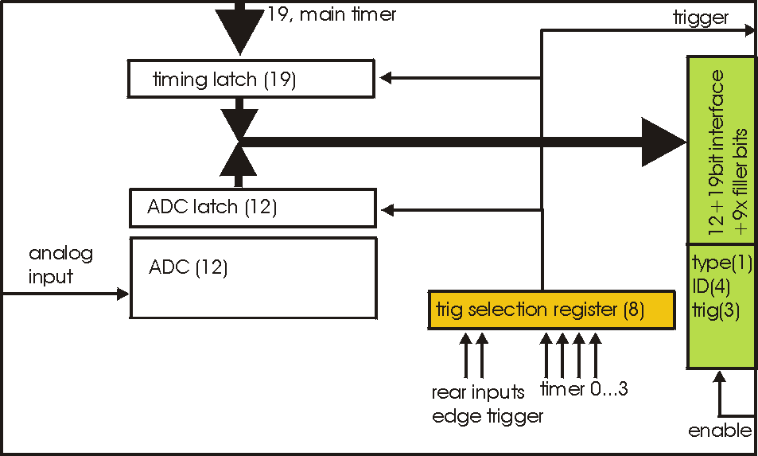

.. index:: Overview

PSD+ System Overview
##################################################

High-level overview
==================================================

mesytec psd+ is a readout system for experiments with medium to large numbers
of position sensitive neutron detectors. It provides highly precise TOF timing
and allows the integration of  trigger sources like monitor counters, chopper
signals, …
All events carry a 48 bit wide timestamp with 100 ns timing resolution.

One ore more central units collect all neutron data as well as auxiliary
signals from monitor counters, chopper systems and environmental sensors.

The peripheral units, responsible for (pre-)amplification, position calculation
of the neutron events as well as for basic testing can be controlled remotely.

The following figures show a general setup as an example:

.. figure:: images/psd+_system.png

   PSD+ system overview

   PSD+ system overview part 2

Up to eight position sensitive detector tubes are connected to one peripheral
module MPSD-8+. Calculated event positions are transmitted on a point to point
bus connection to the central modules MCPD-8. Each MCPD-8 can serve up to 8
peripherals = 64 detectors.

Data are collected and buffered in the MCPD-8 and transmitted to one or more
control and DAQ computers. Communication uses UDP/IP on a 100 Mbit/s Ethernet
connection.

Main components
==================================================

mesytec psd+ systems consist of three principal components:

1. “Peripheral modules” like MPSD-8+

   They interface to the detectors, do the analog signal processing, calculate
   energies and positions, generate digital data on positions and a
   differential timing. They have several parameters (gains, thresholds, test
   pulsers …) that can be controlled remotely.

   Data communication takes place on a dedicated high speed serial interface
   between peripheral and central modules.

   .. figure:: images/mpsd8-schematic.png

      MPSD-8+ schematic

2. Central module MCPD-8

   Are responsible for data buffering, control of and communication with
   peripheral modules. They are the interface to the data acquisition and
   control computer(s).

   Data communication takes place on the high speed serial interface towards the
   peripheral modules and on 100 Mbit/s Ethernet towards daq computers.

   Communication with the MCPD-8 via UDP/IP protocol is the way to control all
   system parameters.

   .. figure:: images/mcpd8-schematic.png

      MCPD-8 schematic

3. Data acquisition and control computers

   At least one computer is required in order to control the psd+ system and to
   collect the data generated by the peripheral modules.

   Communication takes place between computer and central module, allowing also to
   control the peripheral module parameters.

Possible Setups
==================================================

The range of possible setups stretches from the minimum system, with one
peripheral module MPSD-8+, one central module MCPD-8 and one pc to large
systems with multiple fully equipped MCPD-8 branches – each serving 64
detectors on 8 MPSD-8+.

One MCPD-8 can handle up to eight peripheral modules. Communication takes place
on a deterministic point to point connection, allowing highest data rates. This
setup is recommended for instruments with high event rates and demand for
lowest possible deadtimes.

Several MCPD-8 can be combined to realize a readout system meeting the
requirements regarding number of detectors, data rates and deadtime limits.

At least one data acquisition and control computer is needed to perform three
main tasks:

- control peripheral settings (like gains, thresholds and test pulser)
- collect and store incoming raw data
- preprocess / display event data for online monitoring

In larger setups with high data rates, it can be a good decision to split the
tasks, one computer for control and online monitoring plus separate computers
for data collection and storing may be a good distribution.

Communication protocols
==================================================

There are two protocols used among the mesytec psd+ system:

- A proprietary protocol on the high speed serial interfaces from peripheral to
  central modules. MCPD-8 serves as an interface between the control pc and the
  bus protocol.

- A protocol using the standardized UDP/IP protocol family on Ethernet for the
  communication between central modules and computers. This protocol will be
  called “mesytec protocol” in the following.

mesytec Protocol
--------------------------------------------------

Communication between daq / control computers and the central modules MCPD-8 is
based on the standardized UDP / IP protocol family.

There are two principle kinds of communications in a psd+ system:

- The MCPD-8 modules receive and answer command buffers. Usually commands are
  emitted by a single control PC. Each command is echoed to the commanding
  computer, delivering a command response and a status description as well as a
  variable amount of information.

- During data acquisition, the MCPD-8 modules will emit data packages
  autonomously. The address of the recipient is set up during the
  initialisation process of the system. Thus it is possible to send data
  packages and command answers to different recipients.

For experiments with high data rates, it might be useful to have data taking
distributed on more than one pc.

Both types of communication packets are wrapped in UDP packets.

Using UDP communication allows efficient data transmission without too much
protocol overhead. But it has to be remembered that there’s no intrinsic
protection against packet loss (like in TCP e. g.) Thus some simple control
mechanisms have been implemented into the mesytec protocol in order to achieve
sufficient data security.

Functional description
==================================================
All commands are used to control properties and behaviour of two main targets:

  * The peripheral modules MPSD-8, MSTD-16 and the “peripheral part” of an MDLL
    module

  * The central module MCPD-8 and the “MCPD-8 part” of an MDLL module

While MPSD-8 and MSTD-16 have only few properties to control, MDLL features are
a little bit and MCPD-8 is far more complex.

All are controlled by sending UDP based command buffers to MCPD-8. Commands for
peripheral units are translated in the central module MCPD-8 (or the MCPD-8
part of MDLL) and transmitted over the serial connections.

MPSD-8
------

Each MPSD-8 has eight dual amplification stages. The gain values are kept
symmetric internally, so there’s one gain value for each MPSD-8 channel.

One common lower threshold for all eight channels allows neutron / gamma
discrimination.

A built in test pulser is useful for remote electronics checks without the need
for neutron signals. Charge is injected at the preamp input, so the complete
amplification, discrimination and position calculation process can be checked.

The pulser signal can be set to each of the eight channels and can be varied in
amplitude and position.

Thus, an MPSD-8 has the following parameters to be controlled remotely:

Amplification and discrimination unit:

  * 8 gain values (8 bit)
  * 1 common lower threshold value (8 bit)

Test pulser unit:
  * 1 amplitude (8 bit)
  * 1 channel within module (0 … 7)
  * 1 position within channel (left / middle / right)
  * on / off

MSTD-16
-------

MSTD-16 has 16 individual amplification stages.

A common threshold setting is applied to all 16 channels.

The internal test pulser can be set to each of the 16 channels and can be
varied in amplitude.

Thus, an MSTD-16 has the following parameters to be controlled remotely:

Amplification and discrimination unit:

  * From firmware version 9.8 onwards: 16 gain values (8 bit)
  * Up to firmware version 9.7: 8 gain values for pairs of channels
  * 1 common lower threshold value (8 bit)

Test pulser unit:
  * 1 amplitude (8 bit)
  * 1 channel within module (0 … 15), defined by 8 channels and left/right position
  * on / off

MCPD-8
------

The central processing module MCPD-8 offers the following groups of properties
/ functional modules:

Address and communication parameters
~~~~~~~~~~~~~~~~~~~~~~~~~~~~~~~~~~~~

* Device ID

  Each MCPD-8 in a system is given a device ID that is used for all
  communication. The device ID can be set individually during initialisation and
  is remembered after power up. It is in the responsibility of the user to keep
  IDs unique.

* Device ip address
  IP address of the MCPD-8. Also stored permanently, can be set to every valid
  address.

  A “panic button” inside the MCPD-8 allows to reset the address to a default
  value “192.168.168.121”.

* Data host ip address

  MCPD-8 is able to send data buffers to a dedicated DAQ ip address to split up
  data taking and control tasks. This address can be preset and is remembered
  after power up.

* UDP port numbers

  UDP port number for command and data buffers can be set to a desired value.
  Values are saved permanently. If not set, the port number of the last cmd
  packet is used.

Timing parameters
~~~~~~~~~~~~~~~~~

* Timing master

  A flag to define whether a device operates as timing master or slave.

* 48 bit master clock

  Master timing register, can be set to any value and is incremented every 100
  ns during data acquisition.

* Termination of sync line

  Timing sync line has to be terminated at the end, so the last MCPD-8 has to
  be set to sync “on”.

General properties
~~~~~~~~~~~~~~~~~~

* Run id

  An arbitrary 16 bit value to identify the current run. Value is transmitted
  in every data buffer header. Run ID value of the master MCPD-8 will be
  propagated via sync bus.

Functional units
~~~~~~~~~~~~~~~~

Besides the aggregation of neutron event data, MCPD-8 can contribute own data
originating from six digital (TTL) and two analog inputs.

To process these external signals, it provides functional units for triggering,
counting and AD/DA conversion.

Timer, counter, capture units, ports:

An MCPD-8 offers a total of:

  * four auxiliary timers (16 bit wide, 10 us time base, 655 ms max. period)
  * six triggerable counter cells (21 bit wide)
  * two triggerable ADC cells: 12 bit, +/-4,5 V (jumper closed) or 0...9V (open)
  * four multi-purpose counters (48 bit wide).
  * Two DAC ports: 12 bit, +/- 3 V (jumper closed) or 0…6 V (open)
  * One RS-232 serial port (default configuration 9.600, 8N1) can be used to
    control / read out external devices (HV sources, sample environment, …).
    Strings can be sent and answers read back.

Auxiliary timers
^^^^^^^^^^^^^^^^

Besides the central TOF timing unit, the MCPD-8 has four auxiliary timer units
that are intended as trigger sources for auxiliary event triggering.

Each auxiliary timer is a possible trigger source for one of the six counter
cells or one of the two ADC cells.

Triggering a counter or an ADC cell leads to the generation of a trigger event.
A trigger event is a timestamped entry in data stream, comparable to a neutron
data event. It carries the according counter value or ADC value together with
the precise 19 bit timestamp. Auxiliary event data format is described above.

The auxiliary timers are reset automatically at DAQ start or reset. They have a
time base of 10 us and a width of 16 bit, leading to a maximum period of 655,36
ms.

A capture register associated with each timer defines the value at which the
timer unit triggers the associated event(s).  Every time the capture register
equals the timer, a trigger is generated and the timer is reset. Thus it is
possible to generate a trigger with a period between 10 us and 655.36 ms.

Timers are assigned to their data sources in the counter/ADC control registers.
One timer can trigger more than one data source.

Auxiliary timers do not stop at DAQ stop. This enables e.g. a continuous
transfer of ADC data when waiting for a change in sample environment.

Auxiliary timer configuration is done by command #11 (set auxiliary timer), the
only parameter to submit is the capture register value.

Counter cells
^^^^^^^^^^^^^

Counter cells can be used e.g. for monitor counters, chopper inputs, auxiliary
timing purposes and more.  They can be used as simple counters and are also
able to generate timestamped events within the data stream.

They operate like shown schematically below:

   MCPD-8+ counter cell

Inputs
^^^^^^

Each counter cell is driven by one dedicated TTL input.

The assignment of input and counter cell is defined by hardware as follows:

.. table:: Cell inputs
  :name: mcpd-cell-inputs

  +----------+---------------------+
  | Cell No. | Input               |
  +==========+=====================+
  | 0        | Monitor / Chopper 1 |
  +----------+---------------------+
  | 1        | Monitor / Chopper 2 |
  +----------+---------------------+
  | 2        | Monitor / Chopper 3 |
  +----------+---------------------+
  | 3        | Monitor / Chopper 4 |
  +----------+---------------------+
  | 4        | Dig. Input 1        |
  +----------+---------------------+
  | 5        | Dig. Input 2        |
  +----------+---------------------+

4 x Monitor / Chopper on the frontpanel
2 x Digital Input on the backpanel

Counters
^^^^^^^^

Each cell has a 21 bit counter cell which increments on the rising edge of the
TTL input signal. There are two possibilities to read out the counters:

* Counter values can be copied into each transmitted data buffer header by
  defining them as a source for a so called “Parameter”. (Please refer to the
  data buffer header description, as well as to the parameter command
  description for details.)

  Thus they are transmitted whenever a data buffer is transmitted (which is every
  40 ms minimum).

  Parameters are latched at the time of buffer creation, so their values have the
  same timestamp as the header.

  This operating mode is intended e.g. for continuous transmission of counter
  values, where a precise readout frequency or single event detection is not
  the issue. (e. g. monitor counters)

* Counters can be configured to emit a timestamped trigger event, based on
  several trigger sources. When triggered, the latched values of the main timer
  (19 bit) and the counter (21 bit) are – together with some operational
  information – written into a trigger event like described above. The trigger
  event is then immediately buffered within the current data buffer.

  This operating mode is intended for counter sources where detection and
  timestamping of single events (e.g. choppers), counter overflows (stop on
  monitor counts, ...) or a precise readout timing is required.

Both operating modes can be combined (e.g. configuring a monitor counter as a
parameter source and as a trigger event source.

Triggering
^^^^^^^^^^

Event trigger sources for a counter cell can be:

.. table:: Event trigger sources
  :name: mcpd-event-trigger-sources

  +------------+------------------------------------------------+
  | Trigger ID | Trigger source                                 |
  +============+================================================+
  | 0          | No Trigger (only counting)                     |
  +------------+------------------------------------------------+
  | 1          | Aux Timer 1                                    |
  +------------+------------------------------------------------+
  | 2          | Aux Timer 2                                    |
  +------------+------------------------------------------------+
  | 3          | Aux Timer 3                                    |
  +------------+------------------------------------------------+
  | 4          | Aux Timer 4                                    |
  +------------+------------------------------------------------+
  | 5          | Dig Input 1 (rear panel)                       |
  +------------+------------------------------------------------+
  | 6          | Dig Input 2 (rear panel)                       |
  +------------+------------------------------------------------+
  | 7          | Compare Register (allows also self triggering) |
  +------------+------------------------------------------------+

Using one of the Aux Timers as trigger source will lead to generation of
trigger events with a frequency defined by the Aux Timer.

Digital Inputs will count and trigger on the rising edge of the TTL input
signal.

Triggering by Compare register has three different operating modes:

* writing a value from 0 to 20 triggers whenever the bit specified by the given
  value becomes “1”. For example: a compare register value of “0” will lead to
  triggering every second count, “2” triggers every eight counts ...
* a compare register value of 21 triggers on counter overflow
* a compare register value of 22 (as a special value) triggers on every rising edge of the input

Triggering on every rising edge for example allows to generate timestamped
chopper signals.

Configuring a counter / ADC cell just requires setting two values for the
respective cell address:

  * trigger source:
    - 0: no trigger
    - 1 … 4: trigger on aux timer 1… 4
    - 5, 6: trigger on rising edge at rear input 1, 2
    - 7: trigger from compare register (7 only for counter cells)

  * compare register (numerical value n):
    - 0 … 20: trigger on bit n = 1
    - 21: trigger on counter overflow
    - 22: trigger on rising edge of input
    - (can be left blank for ADC cells)

This setup is done using cmd #9 (Set counter / ADC cell), described in detail below.

ADC cells
^^^^^^^^^

ADC cells operate principally similar to the counter cells. Their data have 12
bit resolution (which are extended by 9 leading zeroes to keep the data format
compatible).

Full range is +/- 4,5 V or 0 … 9 V, depending on jumper setting inside MCPD-8.

They can be used e.g. for a continuous monitoring of ambient parameters as well
as of sample environment. The ADC values are stored in registers at a sampling
rate of 25 kHz they can be read out randomly at any time and rate. (although
their contents will only change with 25 kHz).

   MCPD-8+ ADC cell

Inputs are the two analog inputs on the backpanel.

The ADC cells can be triggered by:

  - one of the four programmable auxilliary timers
  - one of the two digital inputs on the backpanel

Multipurpose counters (“Parameters”)
^^^^^^^^^^^^^^^^^^^^^^^^^^^^^^^^^^^^

MCPD-8 offers four additional 48 bit wide multipurpose counters / data fields.
Their values are automatically transmitted as parameter 0 … 3 with every data buffer.

Data buffers will be emitted whenever an event buffer is full, but with a
minimum frequency of 25 Hz. So the multipurpose counters are a good means for a
continuous monitoring of counting inputs.

All six TTL inputs can operate as counter source:

  - 4 x Monitor / Chopper on the frontpanel
  - 2 x Digital Input on the backpanel

Furthermore, a parameter field can carry a copy of one of the following information:

  - Event counter
  - Master clock
  - Current status of all digital inputs and ADCs

Parameter 0 and 1 will stop on a stop command and will continue / update on a
continue command. Parameter 2 and 3 will run continuously.

The assignment of parameters is done by command #11 (set parameter source):

Each one of the four possible parameters can be assigned one of the following sources:

  - 0 … 3: Monitor/Chopper inputs 1…4
  - 4, 5: backpanel TTL inputs 1, 2
  - 6: combination of all digital inputs, and both ADC values
  - 7: event counter
  - 8: master clock

Counter / Port Status Polling
^^^^^^^^^^^^^^^^^^^^^^^^^^^^^

As a last means to derive counter values and port status from MCPD-8, there’s a
polling command that delivers all possible data sources in one cmd answer
buffer:

  - Parameter 0 … 3
  - 6 digital inputs
  - 2 digital outputs
  - 2 ADC inputs
  - 2 DAC outputs

Application Considerations
==================================================
The various functional units of the MCPD-8 allow building a highly flexible
system, delivering exactly the data needed by an instrument. Not only neutron
data , but also environmental parameters can be recorded in several ways.

As it is not really self explaining how to use the many flexible possibilities
the PSD system offers, here are some considerations and hints that might be
helpful adapting the readout system to an instrument.

Data Sources
------------

The PSD system offers three different kinds of data:

* Neutron event data, generated in a MPSD-8 or MSTD-16 module:

  Position and / or Energy information, together with a detector address and a
  precise event timestamp.

* Counter / TTL event data, generated in MCPD-8:

  Counter values are buffered immediately on triggering together with ID
  information and a precise timestamp, just like a neutron event.

   - Sources:

     All six TTL inputs can each be used to drive a counter.

   - Triggers:

     Counter event readout can be triggered from one of four trigger sources:

     * One of four auxiliary timers:

       This allows for repeated readout at fixed intervals (e.g. to get an easy
       monitor rate calculation.)

     * One of two auxiliary TTL inputs:

       This allows for a readout at a status that may be defined by any
       external device (e.g. a “ready” signal from sample environment).

     * Increments over a defined bit position of the counter register.

       An event will be triggered when this bit toggles from 0 to 1.

       E.g. a “0” in compare register (means: “trigger, whenever bit 0 becomes
       “1”) generates a trigger every second count.

       A “2” in compare register (means: “trigger, whenever bit 2 becomes “1”)
       will trigger every 8 counts, …

       This allows reading the counter value at any binary power up to 20.

     * Edge triggering of the TTL input:

       Every rising edge of the TTL input triggers an event.

       This might be useful e.g. to generate precisely timestamped chopper
       signal events, start or stop events correlated with sample environment,
       …

* ADC event data:

  - Sources:

    Two 12 bit ADCs with a selectable full range of +/-4,5 or 0...9 V are read
    out continuously with a sampling rate of 25 kHz automatically. The
    corresponding registers can be read out and transmitted as timestamped ADC
    events.

  - Triggers:

    ADC data readout can be triggered by nearly the same trigger sources as
    counters described above:

    * One of four auxiliary timers:

      This allows for repeated readout at fixed intervals (e.g. to get a
      continuous readout of changing environmental parameters like temperature,
      fields, pressure, ...)

    * One of two auxiliary TTL inputs:

      This allows for a readout at a status that may be defined by any external
      device (e.g. a “ready” signal from sample environment)

    (There's no self-triggering with a compare register for the ADCs.)

Examples
--------

Chopper Signals
~~~~~~~~~~~~~~~

Chopper signals need precise timing, so it's a good application for a self triggering TTL input:

    * Connect the TTL signal from copper electronics to one of the four
      Monitor/Chopper inputs or to one of the backpanel TTL inputs.
    * Configure the according counter cell using cmd #9 with:

        - cell#: 0-3 for frontpanel, 4,5 for backpanel
        - trigger source = 7 (trigger on compare register)
        - compare register value = 22 (trigger on rising edge of input)

Now each time the TTL input rises, a trigger event is generated, timestamped
and buffered with the following data :

	- TrigID = 7 (compare register)
	- DataID = n (n=address of input)
	- Data = counter value (may perhaps be discarded in data processing for chopper pulses)

If a divider for chopper pulses is required, the compare register can be set to
values other than 22: a „0“ will lead to triggering every second rising edge, a
„1“ every fourth“, ...

Monitor Counters
~~~~~~~~~~~~~~~~

Monitor counters normally don't need precise timing with a 100 ns timebase. So
there are several possibilites for monitor counter readout – depending on
instrumental needs:

Connect the monitor counting output (TTL)  to one of the four Monitor/Chopper
inputs or to one of the backpanel TTL inputs.

Monitor counter as header parameter
~~~~~~~~~~~~~~~~~~~~~~~~~~~~~~~~~~~

Define the appropriate counter (0...3: frontpanel, 4,5: backpanel) as source of
one of the four parameter fields that will be transmitted with every data
buffer header.

Use command # 11 with:

	Parameter# = 0...3

	Source = 0..3 for frontpanel inputs, 4,5 for backpanel inputs

Now each time a new data buffer is generated, the defined counters will be read
into their assigned parameter fields. Timestamp is the header timestamp.
Buffers will be generated and transmitted whenever a buffer is full or at least
every 25 ms (40 Hz minimum buffer frequency).

Monitor counter as timer triggered event
~~~~~~~~~~~~~~~~~~~~~~~~~~~~~~~~~~~~~~~~

Using one of the auxiliary timers as trigger source, monitor counter values can
be transmitted with a constant frequency: timebase for the 16 bit timers are 10
us, the maximum interval is therefore 655,36 ms.

    * Configure one of the four auxiliary timers with the appropriate trigger
      interval, using command #10:
        - timer# = 0...3
        - capture register 0... 65.536 (e.g. 10.000 for 100 ms intervals)

    * Configure the counter cell using command #9:
        - cell# = 0..3 for frontpanel inputs, 4,5 for backpanel inputs
        - trigger source = 1...4 for aux timer 0...3
        - compare register:  will not be used

Now each time the auxiliary timer reaches the capture value, a trigger event
will be generated, timestamped and buffered with the following data :

	- TrigID = 1...4 (timer#)
	- DataID = n (n=address of input)
	- Data = monitor counter value

Monitor counter as counter triggered event
~~~~~~~~~~~~~~~~~~~~~~~~~~~~~~~~~~~~~~~~~~

    * Configure the according counter cell using cmd #9 with:

        - cell#: 0-3 for frontpanel, 4,5 for backpanel
        - trigger source = 7 (trigger on compare register)
        - compare register value = 0...21

Now each time the bit position defined in compare register value becomes „1“, a
trigger event is generated, timestamped and buffered with the following data :

	- TrigID = 7 (compare register)
	- DataID = n (n=address of input)
	- Data = counter value (may perhaps be discarded in data processing for chopper pulses)

This allows reading out monitor counters at any power of from 21 up to 222

Monitor counter as edge triggered event
~~~~~~~~~~~~~~~~~~~~~~~~~~~~~~~~~~~~~~~

Identical to chopper signals described above.

External analog data, timer triggered
~~~~~~~~~~~~~~~~~~~~~~~~~~~~~~~~~~~~~

Many instruments need information from other components of the setup:
temperature, pressure, fields, …

Often these values can be read out by an analog voltage signal. MCPD-8 allows
to digitize such signals and fill the according values into the data stream.

Just like described above for monitor counters, also the ADC readout can be
triggered by auxiliary timers:

    * Configure one of the four auxiliary timers with the appropriate trigger
      interval, using command #10:
        - timer# = 0...3
        - capture register 0... 65.536 (e.g. 10.000 for 100 ms intervals)

    * Configure the ADC cell using command #9:
        - cell# = 6,7 for ADC input 1, 2
        - trigger source = 1...4 for aux timer 0...3
        - compare register:  will not be used

Now each time the auxiliary timer reaches the capture value, a trigger event
will be generated, timestamped and buffered with the following data :

	- TrigID = 1...4 (timer#)
	- DataID = n (n=address of ADC input)
	- Data = ADC value (12 bit valid data, 9 bit leading zeroes)

External analog data, TTL triggered
~~~~~~~~~~~~~~~~~~~~~~~~~~~~~~~~~~~

ADC readout can also be triggered by an axternal TTL signal, which can be an
end point switch, an external frequency source, …

    * Configure the ADC cell using command #9:
        - cell# = 6,7 for ADC input 1, 2
        - trigger source = 5,6 for backpanel TTL inputs 1,2
        - compare register:  will not be used

Now on each rising edge of the assigned backpanel TTL input a trigger event
will be generated, timestamped and buffered with the following data :

	- TrigID = 5, 6 (TTL input)
	- DataID = n (n=address of ADC input)
	- Data = ADC value (12 bit valid data, 9 bit leading zeroes)

External analog data, continuously transmitted with buffer header
~~~~~~~~~~~~~~~~~~~~~~~~~~~~~~~~~~~~~~~~~~~~~~~~~~~~~~~~~~~~~~~~~

If external data just have to be monitored, but precise timing is not the
issue, data transmission in one of the four parameter fields of the buffer
header may be a solution:

Use command #11 to set up the selected parameter field for transmission of the
ADC values: Source = 6 will transmit a combination of both TTL input levels and
both ADC values in the selected parameter field.

Buffers are transmitted whenever they are full with events or latest every 40
ms. Values and timestamps are generated at the moment of buffer generation.

Combination of timers, triggering, counting and header parameters
~~~~~~~~~~~~~~~~~~~~~~~~~~~~~~~~~~~~~~~~~~~~~~~~~~~~~~~~~~~~~~~~~

For a sophisticated setup, most of the readout possiblities can be combined.

For example monitor counters:

It may be convenient to have edge triggered, timestamped monitor counter events
in the data stream to allow a count-precise offline data processing from
listmode files.  But it is time consuming to evaluate every event online to
search for a stop condition for data taking. For this purpose it's mostly
sufficient to have the monitor counter as one of the four header parameters to
generate a stop condition.

Same for external parameters:

It might be necessary to have a temperature/field/pressure profile with a
resolution of some hundred microseconds in offline data analysis. So a timer
triggered event generation with the necessary frequency is a good idea.

But for online status monitoring, the ADC values as one of the header
parameters, transmitted every 40 ms latest, should be more than enough in most
cases.

So just configure the data source for triggering as well as for parameter
transmission:

e.g. the monitor counter:

    - use cmd # 9 to set up the appropriate counter cell to trigger an event on
      every rising edge of the input
    - use cmd # 11 to define the same counter as source for one of the
      parameter fields

Thus the monitor counter value will be transmitted as an event on each rising
edge (to be used in offline data processing if necessary) AND it will be
transmitted with every buffer header (e.g. for economical generation of stop
conditions).
